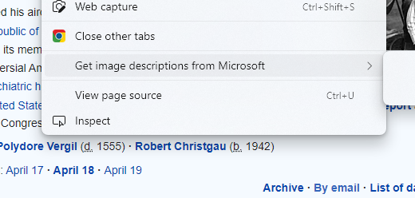

    
  </a>

<h1 align="center">Control Chrome Tabs</h1>

  Close all tab with a single click

 

  <!-- Standard -->
  

## ⚡️  Introduction
Control Chrome Tabs helps you to close all the unnecessary tabs of our browser with a single click

## Tech Stack used:
* JavaScript

## 📷 Screenshots

## ‎‍💻 Authors

- [@iamrahulmahato](https://www.github.com/iamrahulmahato)
## ⭐️ Show your support

Give a star if this project helped you!
