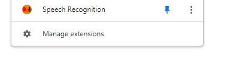

    
  </a>

<h1 align="center">Speech Recognition</h1>

  Covert audio to text

 

  <!-- Standard -->
  

## ⚡️  Introduction
Speech Recognition helps you to Covert audio to text not just in english other lang too

## Tech Stack used:
* Html
* CSS
* JavaScript

## 📷 Screenshots

## ‎‍💻 Authors

- [@iamrahulmahato](https://www.github.com/iamrahulmahato)
## ⭐️ Show your support

Give a star if this project helped you!