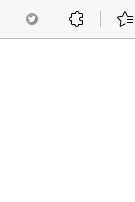
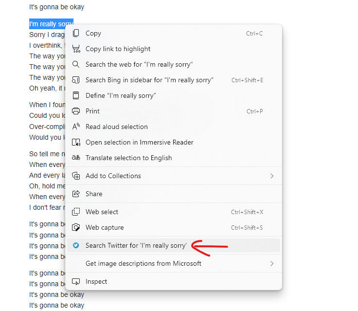

    
  </a>

<h1 align="center">Twitter context Menus</h1>

  Twitter context Menus made using JS.

 

  <!-- Standard -->
  

## 📷 Screenshots

## ‎‍💻 Authors

- [@iamrahulmahato](https://www.github.com/iamrahulmahato)
## ⭐️ Show your support

Give a star if this project helped you!
