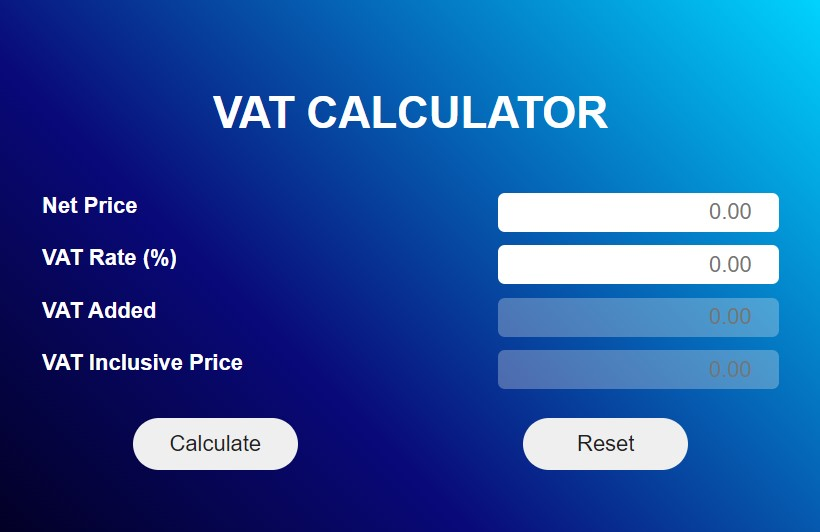
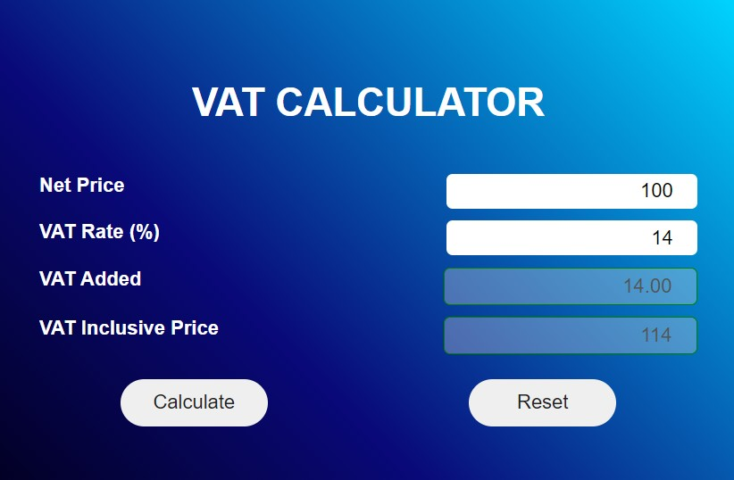

 
  

  

# VAT Calculator Extension
This extension helps you calculate the value added and the inclusive price after applying VAT (Value Added Tax).

## ScreenShots

  
# Tech Stack Used:
1. HTML
2. CSS
3. JavaScript
4. Chrome Extension API
