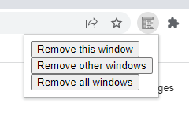

    
  </a>

<h1 align="center">Window Remover</h1>

  Window Remover made using HTML, CSS AND JS.

 

  <!-- Standard -->
  

## ⚡Feature

- Remove recent window
- Remove Other windows
- Remove All windows

## 📷 Screenshots

