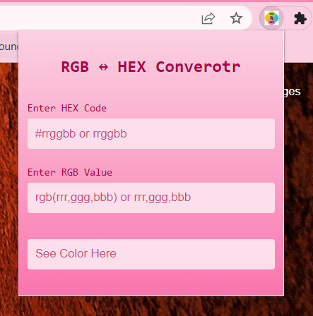
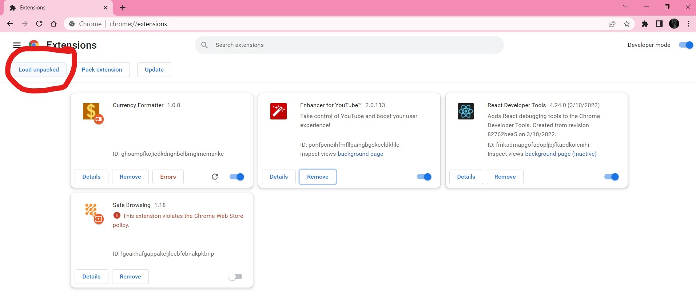
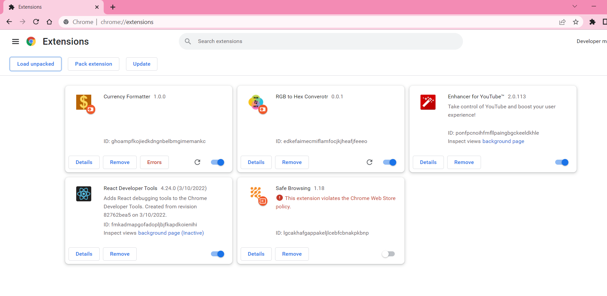
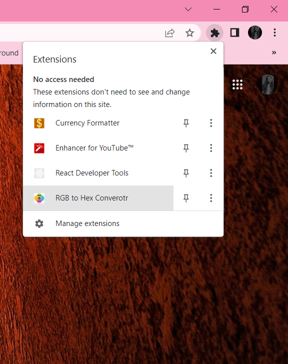
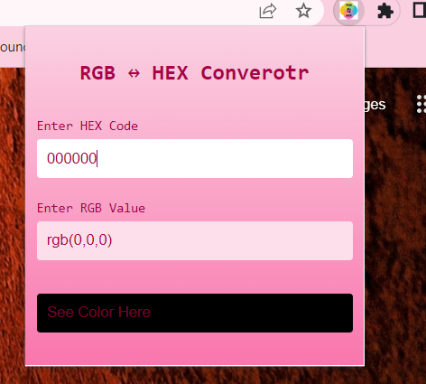

# 
RGB to HEX Convertor

# STEPS:
### 1. Open Chrome Extension and click on Load Unpacked

### 2. Select the folder "rgb to hex convertor" and you are good to go.

### 3. Click on Extension and select "RGB to HEX Convertor".

### 4. Enter RGB or HEX code value and see the output

  
# TECH STACK USED:
  1.) HTML  
  2.) CSS  
  3.) JavaScript  
  4.) Chrome Extension API

